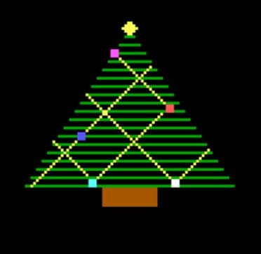

# Command Line App
This is a command line application in NASM run on VM

# Implemented cli functions
* help
* about
* secret
* draw

### Output of the `draw` function

# Run the programm

1. To re-compile the files use:
```
nasm cli.asm -f bin -o cli.bin
nasm loader2.asm -f bin -o loader2.bin
```

2. Create os.bin from loader and main app
```
copy /b loader2.bin + cli.bin os.bin
```
3. Create a floppy.img file using the follwoing command:
```
copy /b os.bin os.img
```

Use `instructions.txt` to configure `VirtualBox`